# NeOS

A small operating system for the [M5Stack Tab5](https://docs.m5stack.com/en/products/sku/K145) —
an ESP32-P4 tablet with a 5" 1280x720 MIPI-DSI panel, 32 MB of PSRAM and a
10-point touchscreen.

NeOS is the firmware. Everything you see is an app: an ELF file on the microSD
card, loaded into PSRAM, relocated against a syscall table and run. The
launcher itself is one of those apps — change one line of `autorun.cfg` and a
different shell comes up.

<p align="center">
  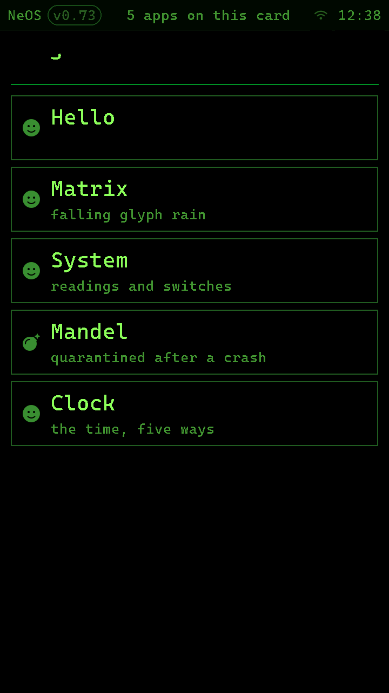
</p>

## What it looks like

| | |
|---|---|
| 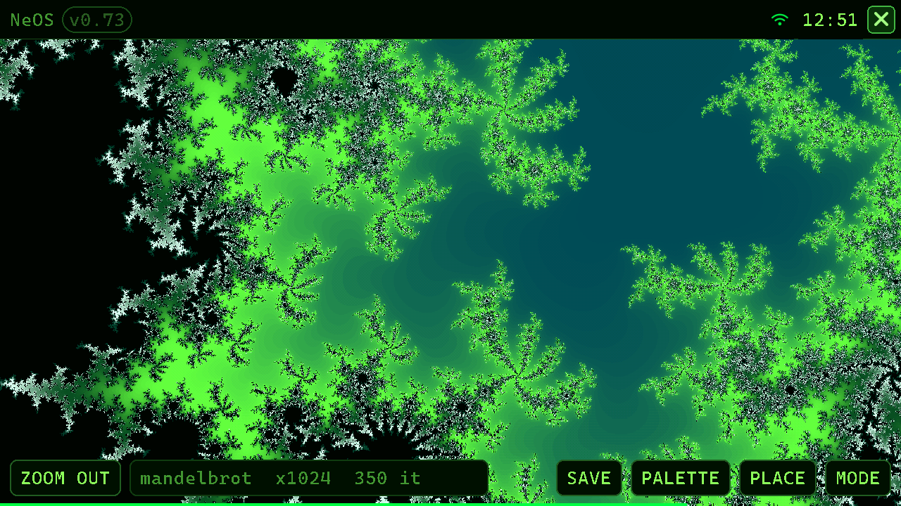 | **Mandel** — drag a frame to zoom, tap to dive, `ZOOM OUT` walks back through the views you came in by. `SAVE` writes an 8-bit PNG to the card with the view's coordinates in a `tEXt` chunk, so it can be recoloured later. Single precision only: apps link `-nostdlib`, and a stray `double` is a load failure rather than a slow frame. |
| 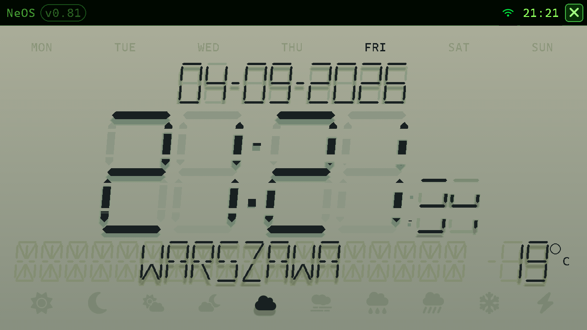 | **Clock** — the same time drawn five ways (LCD, VFD, LED in two colours, e-paper, NeOS). A face is a paint function plus a frame rate; the shell owns the time, the rotation, and which face survives a reboot. The weather under it comes from the OS, not from the app. |
| 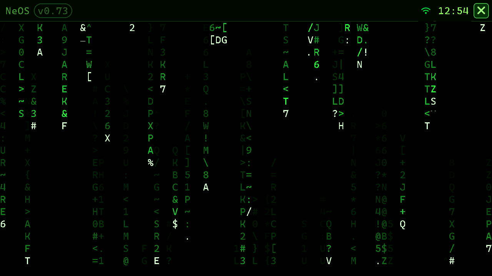 | **Matrix** — falling glyph rain, and mostly an exercise in *not* redrawing. The trail fade is quantised into bands so a cell is repainted only when a boundary crosses it, and the frame is flushed in horizontal strips because `ngl_flush()` costs rows, not pixels. |
| 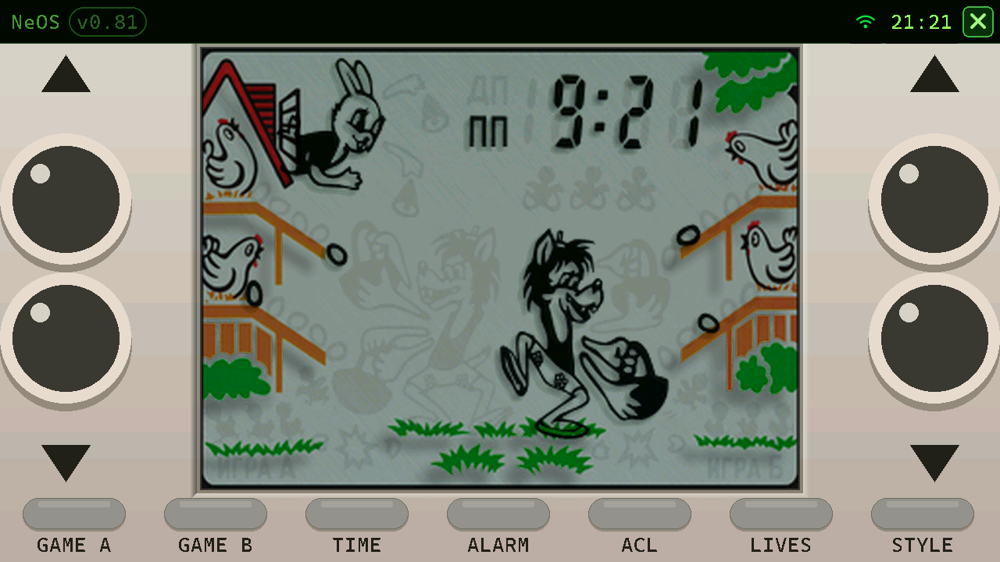 | **Nu, pogodi!** — a КБ1013ВК1-2 emulator, and mostly an exercise in not owning the clock. The game is 1856 bytes of mask ROM; a block of 128 instructions is 256 ticks of the piezo pin, which resamples to exactly 375 frames at 48 kHz, and `neos_audio_write()` does not return until the codec has taken them — so handing over a block of sound *is* letting 7.8 ms of game time go by. There is no timer in the app and no way for the emulated clock and the audible one to drift. The segment artwork it draws is built by [genlcd](tools/genlcd/) and is not in the repo. |
| 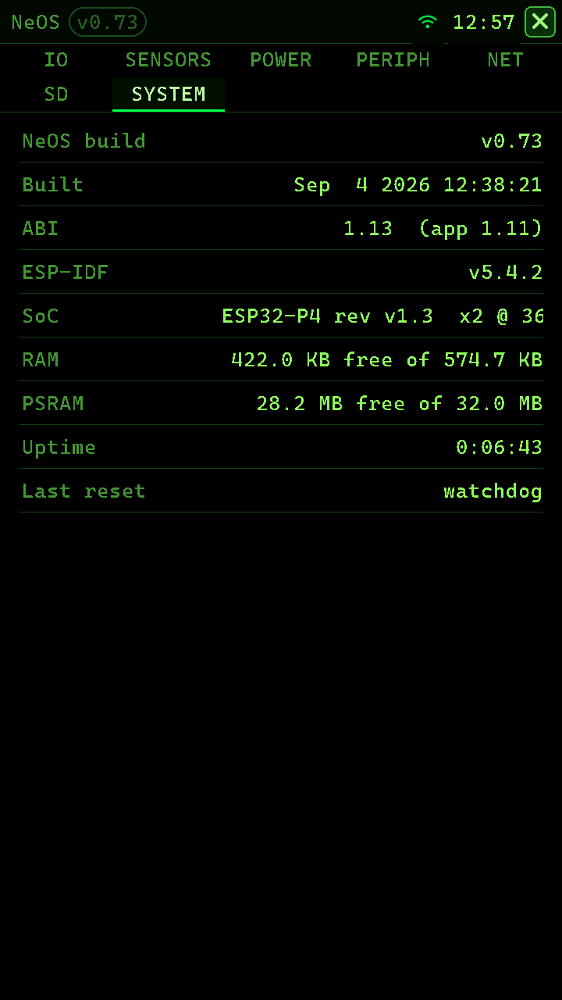 | **System** — readings and switches. IO, sensors, power, peripherals, network, the card, and the build itself. Every row is a table entry plus a function that fills a string, and a value cell is repainted only on the tick its text actually changed. |
| 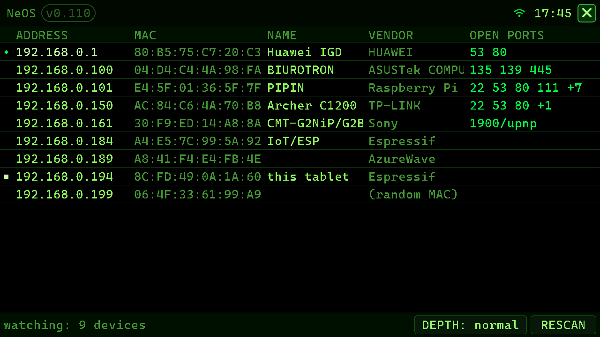 | **LAnSCan** — what else is on this network, and mostly an exercise in having one thread. A port of a terminal scanner that runs a stage per thread and blocks in each; here every stage is a state machine asked to make some progress and give the loop back, because an app runs on NeOS's own stack and a blocking `recv()` is not a slow scanner, it is a close button that has stopped working. The tablet is also *on* the segment it is looking at, so every echo request has to resolve its destination first and a sweep fills the stack's ARP table with everything that is really there — including the hosts that ignore ICMP. ARP is the discovery stage; the port knock only visits addresses that answered something. Names come from mDNS, SSDP, NetBIOS and SNMP; vendors from the IEEE registry, binary-searched off the card by [genoui](tools/genoui/) rather than held in memory. |

System panels belong to the firmware, so they are the same wherever you are:

| | |
|---|---|
| 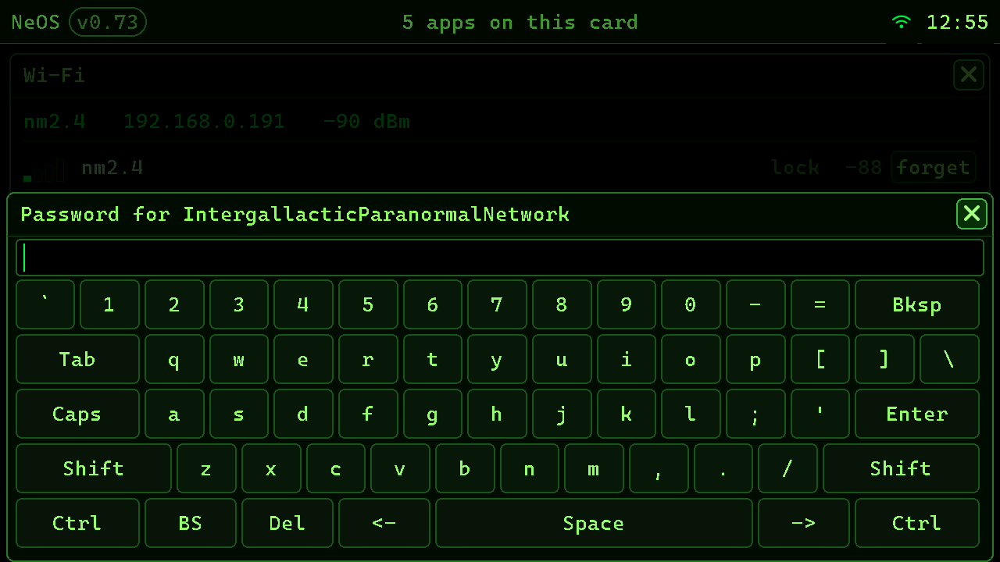 | The Wi-Fi panel and the system keyboard, over the launcher. `neos_input_text()` blocks, and blocking is the feature: the app stops inside the call, which is what makes the keyboard modal without anything having to be suspended. What was on screen is saved and put back, so an app never learns a panel was over it. |
| 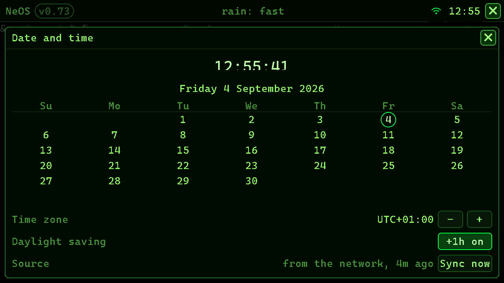 | Date and time, over the Matrix app. Three clocks are kept straight here: the battery-backed RX8130 holds local time, the system clock holds UTC, and SNTP seeds both when there is a network. |

The clock's own two panels are drawn by the app, because ngl's overlay
machinery — the thing that saves the pixels underneath and drops everyone
else's draws — is deliberately not exported: an app that could take the screen
from the OS could take it from the close button. So both are ordinary opaque
panels over the face, and getting back is an ordinary full repaint, which a
face has to be able to do anyway.

| | |
|---|---|
| 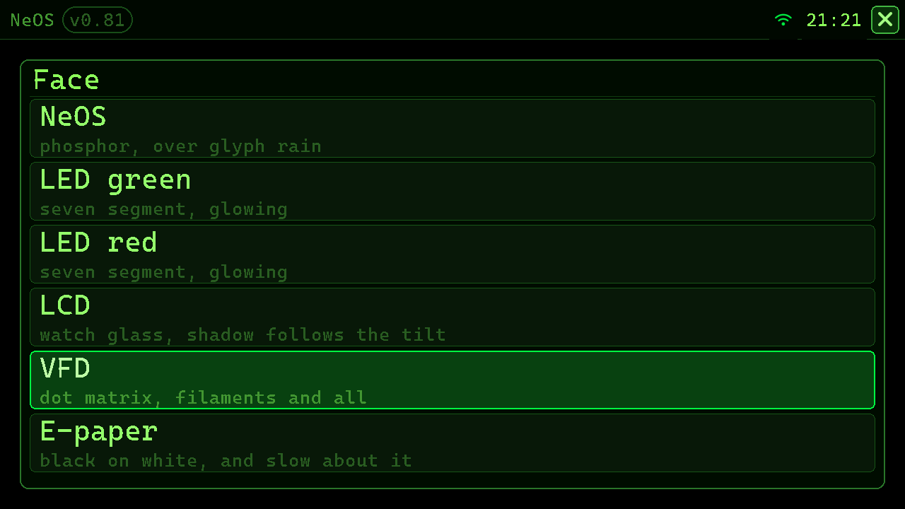 | The face picker. A face is a table row — a name, a blurb, a paint function and a frame rate — so the list *is* the table, and adding a face adds a line here. It blocks the same way the system keyboard does, and for the same reason: one app is resident, and it is the one that stopped inside the call. |
| 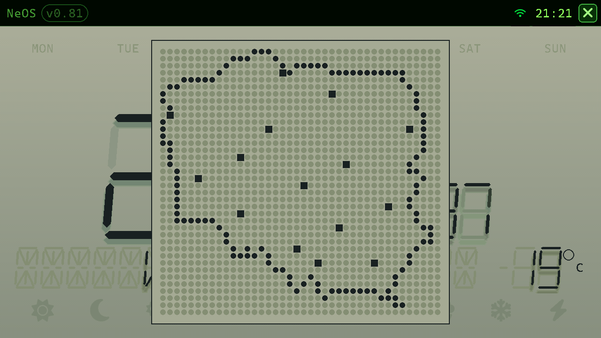 | Picking where the weather is, over the LCD face and in that face's own three colours, so it reads as one more module in the same glass. The place band says whatever the tablet's address geolocated to, which is right about as often as an IP database is, so it has to be possible to say *no, here* — and a scrolling list of fifteen names would be the one thing on the glass that gives the act away. A dot-matrix module needs no words: every cell is drawn because that is what an unlit cell looks like, cities are squares rather than dots, and the nearest one to the touch wins. It changes the name and nothing else — `neos_weather.h` geolocates the address and has no way to be told where to fetch for. |

## How it works

```
              microSD card
              ├── autorun.cfg          app = launcher
              └── apps/
                  ├── launcher/{manifest.json, app.elf}
                  ├── clock/   {manifest.json, app.elf}
                  └── ...
                        │
                        │  read, relocated by name, run
                        ▼
    ┌──────────────────────────────────────────────────┐
    │ NeOS firmware (neos/)                            │
    │                                                  │
    │  syscall table ── ngl ── panel, touch, Wi-Fi,    │
    │                          RTC, IMU, weather, card │
    └──────────────────────────────────────────────────┘
                    ESP32-P4 + ESP32-C6 radio
```

**One app is resident at a time.** It runs as ordinary code on the firmware's
own stack, which is why nothing can kill it from outside: an app exits by
returning from `main()`. `neos_exec("clock")` records where to go next, and the
handover happens on that return.

**Apps are relocated by name.** The loader takes each undefined symbol in an
app's ELF and looks the string up in the firmware's table
([neos_syscalls.c](neos/main/neos_syscalls.c)). Nothing resolves by index, so
the table can be reordered and grown freely and older apps keep running. An app
that draws with `ngl` carries none of it — `hello` is a couple of kilobytes on
the card.

**The ABI is versioned honestly.** `NEOS_ABI_MAJOR.MINOR`, currently 1.19; see
[neos_abi.h](neos/components/neos_api/include/neos_abi.h). Minor is additive.
The firmware defines one small object per released minor and an app emits a
reference to the single row it was built against, so the *linker and the
loader* do the version check between them, with nothing to keep in sync by
hand: an app built against 1.4 fails to load on a 1.3 firmware with `Can't find
common neos_abi_1_4`. Struct layouts that cross the boundary are frozen by
`_Static_assert`.

**A crashing app is quarantined.** NeOS drops a breadcrumb in NVS before each
launch — NVS and not RTC memory, because the power button is the escape hatch
from a wedged app and it wipes RTC. If the next boot finds the crumb, that app
is counted out and greyed in the launcher, which is the `quarantined after a
crash` line in the screenshot above.

**No LVGL.** NeOS owns the panel and the framebuffer, and apps draw through
[ngl](neos/components/ngl/include/ngl.h) — a framebuffer 2D library in RGB565,
the panel's native format, so there is no conversion on the hot path. Surfaces,
clipping, rounded rects, anti-aliased lines, colour-keyed blits, 1-bit bitmap
fonts and icons. Every draw call marks its own bounds dirty, so a 40x40 button
repaints 40 rows and not 1280. Apps get `ngl_app_area()` rather than the whole
panel: the strip along the top is the firmware's system bar, and its close
button is the same button everywhere.

**The radio is a second chip.** The P4 has none, so Wi-Fi goes over SDIO to an
ESP32-C6 running ESP-Hosted. NeOS owns the connection — one radio, one set of
credentials, one bar icon — and apps read the state rather than associating for
themselves. The same reasoning puts [weather](neos/main/neos_weather.c) in the
firmware: apps have no TLS, no HTTP and no JSON in the syscall table, and two
apps showing the weather should not be able to disagree about it.

What that line is *not* around is the wire. [neos_sock.h](neos/components/neos_api/include/neos_sock.h)
gives an app an IPv4 socket, always non-blocking, plus its own address and mask
and the stack's neighbour cache — the layer below all of the above. A scan is
an app's own transient work that nothing else in the system has an opinion
about, and it still cannot decide which network the tablet is on or whether
there is one. `lanscan` is the app that wanted it.

## Repo layout

| Path | What |
|---|---|
| [neos/](neos/) | The firmware. `main/` holds bring-up, the boot chain, the system bar, the panels and the console link. |
| [neos/components/ngl/](neos/components/ngl/) | The graphics library, exported to apps. |
| [neos/components/neos_api/](neos/components/neos_api/) | The ABI headers — the whole app-visible surface. |
| [apps/](apps/) | Apps, one IDF project each: `launcher`, `hello`, `clock`, `mandel`, `matrix`, `system`, `nupogodi`, `lanscan`. |
| `lab/` | Not here. An app that is not ready to publish is kept in a separate private repo, cloned to `lab/` and gitignored; the build, upload and card scripts look there as well as in `apps/`. An app is at the same depth either way, so publishing one is a move. |
| [scripts/](scripts/) | Toolchain setup, build, flash, upload, screenshot, boot capture, card deploy, ABI check, stock-flash restore. Every one of them, with its invocations, in [scripts/SCRIPTS.md](scripts/SCRIPTS.md). |
| [tools/](tools/) | Build-time generators for fonts, icons and glyphs, the emulator's artwork and the MAC vendor registry. Their output is checked in, except genlcd's and genoui's, neither of which is ours. |
| [docs/specs_fingerprint.md](docs/specs_fingerprint.md) | The hardware, read off this unit rather than off a datasheet. |
| [original_flash/](original_flash/) | The stock M5Stack image, so the tablet can always be put back. |

## Setting local paths

Nothing in the repo names a particular machine's install. Two things differ per
checkout — where the ESP-IDF lives, and what the tablet and the card reader
enumerated as — and both are read from `.env.local` at the repo root, which is
gitignored. Copy the template and edit what needs editing:

```powershell
copy .env.local.example .env.local     # bash: cp .env.local.example .env.local
```

Every key is optional, and on a machine with an ordinary IDF install the file
can stay empty:

| Key | What it is | If unset |
| --- | --- | --- |
| `IDF_PATH` | The ESP-IDF checkout. | Whatever IDF's `export` script put in the environment. |
| `IDF_TOOLS_PATH` | Where the IDF keeps its toolchains and virtualenvs. | `~/.espressif`, which is where the installer puts them. |
| `NEOS_PYTHON` | The interpreter `do` runs the scripts with. | The IDF virtualenv, found through the two keys above. |
| `ESPTOOL` | esptool, for `restore-flash`. | The copy in the IDF virtualenv, then `PATH`. |
| `NEOS_PORT` | The tablet's serial port. | Auto-detected from the ESP32-P4's USB VID (303A). |
| `NEOS_CARD_DRIVE` | The card reader's drive letter. | `G:` |

The environment wins over the file, so a shell that has already been through
`export.ps1` / `export.sh` keeps the values it put there and `.env.local` only
fills the gaps. That is also why `IDF_PATH` matters beyond the scripts:
[neos/main/idf_component.yml](neos/main/idf_component.yml) points the
`espressif/usb` dependency at `$IDF_PATH/components/usb`, expanded when the
component is resolved, so the firmware configures against whichever IDF the
building shell exports. Build from a shell that has not been exported and the
configure step stops there.

One wrinkle: `neos/dependencies.lock` is tracked, because it is what pins the
component versions, but the component manager records that `usb` override as
the *resolved* absolute path. So the lock picks up a one-line diff naming your
IDF the first time you configure. That line is noise — the versions above it
are the part worth committing.

## Building

ESP-IDF v5.4.2, target `esp32p4`. On a machine that has not built this before:

```powershell
.\do.ps1 setup-toolchain -Check            # what IDF is here, if any
.\do.ps1 setup-toolchain                   # install v5.4.2 and record it
```

It lists every IDF checkout it can find with its version, says which one the
scripts would pick, and writes `IDF_PATH` / `IDF_TOOLS_PATH` into `.env.local`.
A download only happens when there is genuinely no v5.4.2 to point at, and it
asks first.

The whole repo at once — the firmware, every app, the ABI check, and, with
`flash-os`, the tablet and the card as well:

```powershell
.\do.ps1 build-all                         # eight projects, then abi_check
.\do.ps1 build-all -Quiet -Apps clock      # one app, one line of output
.\do.ps1 flash-os                          # build, flash, fill the card
```

`build-all` reads which apps exist from `apps/`, and knows that an app build
ends in a linker error it should ignore — see below. The rest of this section is
what it does, for when one project is all that is wanted.

Each app is a separate IDF project, so each compiles the whole IDF — a thousand
objects, 186 MB of build tree — to link an ELF of a couple of KB against
`libmain.a` alone. Since the seven sdkconfigs are identical that is one build
done seven times, and `build-all` runs ccache over it: the first app compiles
902 files in 211 s, the next hits cache on 98% of them and takes 78 s.
[scripts/SCRIPTS.md](scripts/SCRIPTS.md) has the two settings it took to get
that from 0%.

```bash
cd neos
idf.py set-target esp32p4      # once
idf.py flash monitor           # -p COM16 if you have more than one board
```

From a shell that has not been through IDF's `export` - or on a machine where
`export.ps1` picks the wrong virtualenv, which it does whenever the `python` on
PATH is a different minor version from the one the IDF installed - `do.ps1`
does the same job without it:

```powershell
.\do.ps1 flash                             # build, flash, find the port itself
.\do.ps1 flash -Monitor                    # ... and stay on the console
.\do.ps1 flash -Target build               # compile only, no tablet needed
```

The partition table is custom — 6 MB for the app, because the Wi-Fi host stack
does not fit in the stock 1 MB — so a device coming from an older build needs a
full `idf.py flash` and not just the app image.

Apps build the same way, one project each:

```bash
cd apps/hello
idf.py set-target esp32p4      # once per app: there is no sdkconfig.defaults
idf.py build                   # -> build/hello.app.elf
```

> An app build **always ends in `FAILED: hello.elf` / `ld returned 1`, and that
> is normal.** Apps link `-nostdlib -shared` against the syscall table, so the
> ordinary firmware ELF target can never link. The target that matters,
> `hello.app.elf`, is produced before it. Judge the build by that file and by
> `abi_check.py`, not by the exit code.

```bash
python scripts/abi_check.py apps/*/build/*.app.elf
```

`abi_check.py` confirms the ABI guard really survived `--gc-sections` — a guard
that got collected looks exactly like a guard that passed — and that every
symbol the app left undefined can actually be resolved. Pure stdlib, so it runs
without the toolchain on PATH and without pyelftools.

## Working with a running tablet

Everything under `scripts/` wants the ESP-IDF virtualenv's python, which is the
one that has pyserial. `do` / `do.ps1` finds it and gets out of the way. It
has to be run by path, because `do` is a keyword in both shells.

```powershell
.\do.ps1                                   # what there is to run
.\do.ps1 flash                             # build and flash the firmware
.\do.ps1 upload --app clock                # push an app to the card over USB
.\do.ps1 upload --file autorun.cfg
.\do.ps1 launch clock --upload             # push it and run it, in one
.\do.ps1 launch --home                     # back to the card's autorun app
.\do.ps1 screencap --name mandel           # a PNG, not a photograph
.\do.ps1 capture-boot --secs 40 > boot.log
.\do.ps1 deploy-card -Autorun launcher     # -Drive E: to override NEOS_CARD_DRIVE
```

The port is not given above because none of these need one: they find the
tablet by its USB VID. `--port` overrides that for a machine with two boards
plugged in, and `NEOS_PORT` in `.env.local` makes the override permanent.

`launch` is the one that keeps autorun.cfg out of the edit loop. NeOS runs one
app at a time and cannot take the screen back by force, so a launch is a queued
request: the running app is asked to close, and the next one starts when it
returns. That is why the script watches the console afterwards rather than
trusting the reply — "started" means NeOS logged the app onto the screen, and a
timeout means whatever was running is not polling `neos_app_close_requested()`.
`--upload` pushes the built ELF and manifest first, `--shot` brings a PNG back
once it has drawn, and `--watch 20` prints the console while it runs, which
together is a test run without a hand on the tablet:

```powershell
.\do.ps1 launch mandel --upload --shot --watch 20
```

`upload` and `screencap` share the console UART with `ESP_LOG` at 921600 baud.
The upload protocol is text-headed, flow-controlled per block (FATFS commits
slower than the wire delivers) and CRC'd, and a file that fails the check is
deleted rather than left half-written. Screenshots come out of the logical back
buffer — system bar, whatever panel is up, already rotated the way it was being
looked at — with rows numbered and checksummed, so a log line spliced into the
middle of one costs a retry rather than the image. The card never leaves the
slot.

`deploy-card.ps1` is still the way to seed a card from scratch, or to fix one
whose firmware will not boot. It deletes nothing, so a card can carry apps that
are not in this repo.

## Writing an app

The whole of `hello`:

```c
#include "ngl.h"
#include "ngl_theme.h"
#include "neos_api.h"

int main(int argc, char **argv)
{
    ngl_surface_t *sc = ngl_screen();
    const ngl_rect_t a = ngl_app_area();      /* not the whole panel */

    ngl_clear(sc, TH_BG);
    ngl_text(sc, a.x + 20, a.y + 20, "hello", &ngl_font_large, TH_TEXT);
    ngl_flush();

    while (!neos_app_close_requested()) {
        neos_sleep_ms(100);                   /* yield, or starve the shell */
    }
    return 0;
}
```

plus a `manifest.json`, which is what the card carries next to the ELF:

```json
{ "schema": 1, "id": "com.kk.hello", "name": "Hello",
  "type": "elf", "entry": "app.elf", "category": "Other", "api": 2 }
```

`category` is which of the launcher's tabs the app appears under — `System`,
`Tools`, `Games`, `Sound`, `EyeCandy` or `Other`, matched without regard to
case. Leave it out and the app lands on `Other`; an app is never hidden for not
naming a shelf.

The project's `CMakeLists.txt` differs from an ordinary IDF one in two places:

```cmake
set(EXTRA_COMPONENT_DIRS "${CMAKE_CURRENT_LIST_DIR}/../../neos/components")
...
include(elf_loader)     # from espressif/elf_loader
project_elf(hello)      # emits hello.app.elf instead of a firmware image
```

Read [neos_api.h](neos/components/neos_api/include/neos_api.h) for the rest —
touch and taps, text input, the app registry, whole-file reads and writes to
the card — and [neos_sys.h](neos/components/neos_api/include/neos_sys.h),
[neos_net.h](neos/components/neos_api/include/neos_net.h),
[neos_time.h](neos/components/neos_api/include/neos_time.h) and
[neos_weather.h](neos/components/neos_api/include/neos_weather.h) for the
board. Nothing there trades in floats: values cross as scaled integers —
millivolts, milliamps, milli-g, tenths of a degree — so apps stay free of
double-precision printf and of any question about how a float is passed between
two separately linked images.

## Tools

[genfont](tools/genfont/), [genicons](tools/genicons/) and
[genkanji](tools/genkanji/) rasterise the UI font, the icon set and the clock
app's rain glyphs into C source that is checked in, so an ordinary `idf.py
build` never needs Python or Pillow. Generated files carry a `GENERATED - do
not edit` banner: edit the tool or its spec, never the output.

[genlcd](tools/genlcd/) is the exception that proves that rule: it renders a
MAME romset — a mask ROM and an SVG of a plastic case with every LCD segment
traced separately — into the file `nupogodi` reads off the card, and its
output is *not* checked in, because neither input is ours to check in. See its
[README](tools/genlcd/README.md) for what you have to supply and what the
container looks like.
